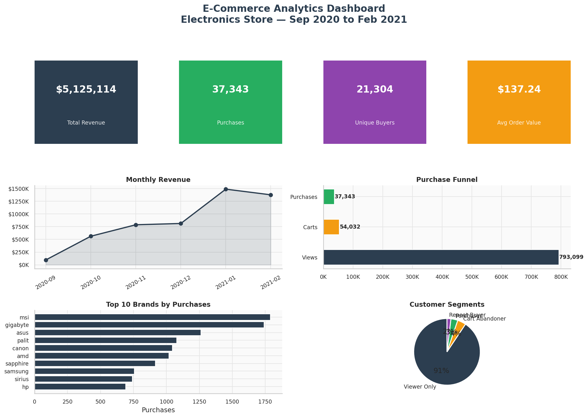
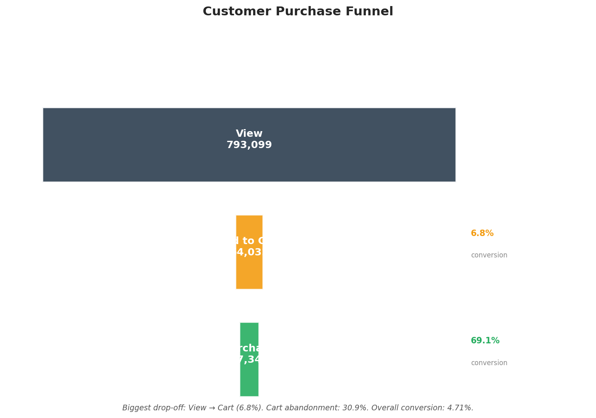
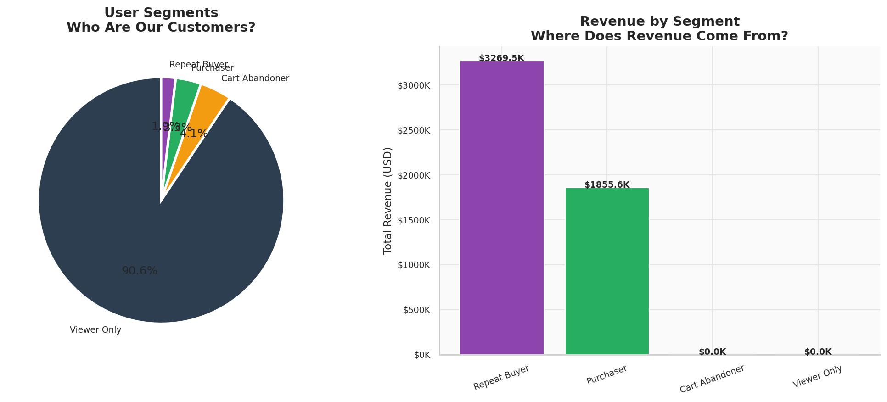
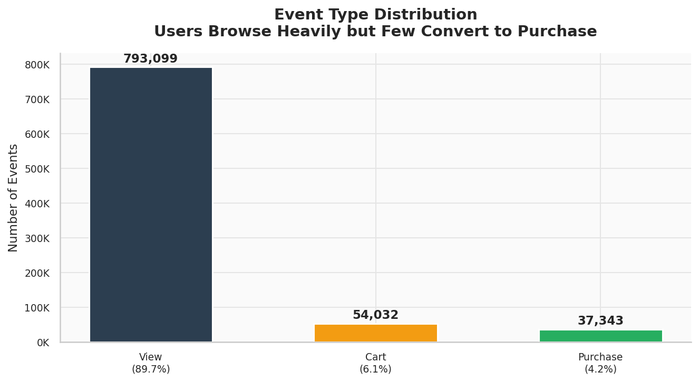

# 🛒 E-Commerce Customer Behavior Analytics

> **Junior Data Analyst Assignment** | Electronics Store | Sep 2020 – Feb 2021

[](https://www.python.org/)
[](https://pandas.pydata.org/)
[](https://matplotlib.org/)
[](https://www.kaggle.com/datasets/mkechinov/ecommerce-events-history-in-electronics-store)

---

## 📋 Project Overview

This project analyzes customer behavioral data from an electronics e-commerce store to understand **why users browse but don't buy**. Acting as a junior data analyst, I performed end-to-end analysis — from raw data ingestion through cleaning, EDA, funnel analysis, segmentation, and actionable business recommendations.

---

## 🎯 Business Problem

The store records hundreds of thousands of product views every month, yet purchases remain a small fraction. The key questions driving this analysis are:

- **Why do 90%+ of sessions end without a purchase?**
- **Where in the funnel are we losing the most customers?**
- **Which products, brands, and categories drive actual revenue?**
- **Which customers are worth targeting for retention and win-back campaigns?**

---

## 📦 Dataset

| Detail | Value |
|---|---|
| **Source** | [Kaggle — E-Commerce Events History in Electronics Store](https://www.kaggle.com/datasets/mkechinov/ecommerce-events-history-in-electronics-store) |
| **Period** | September 2020 – February 2021 |
| **Raw Rows** | 885,129 |
| **Clean Rows** | 884,474 |
| **Unique Users** | 407,283 |
| **Unique Products** | 53,453 |
| **Event Types** | `view`, `cart`, `purchase` |

**Columns:** `event_time`, `event_type`, `product_id`, `category_id`, `category_code`, `brand`, `price`, `user_id`, `user_session`

---

## 🛠️ Tools & Technologies

| Tool | Purpose |
|---|---|
| **Python 3.10** | Core scripting language |
| **Pandas** | Data loading, cleaning, transformation |
| **NumPy** | Numerical computations |
| **Matplotlib** | All chart generation |
| **Seaborn** | Statistical visualization (heatmaps) |
| **JSON** | KPI export and summary output |

---

## 📁 Project Structure

```
ecommerce-analytics/
│
├── data/
│   └── events.csv                  # Raw dataset
│
├── src/
│   ├── clean.py                    # Data cleaning script
│   ├── config.py                   # Configuration and paths
│   ├── dashboard.py                # Dashboard generation script
│   ├── eda.py                      # Exploratory Data Analysis script
│   ├── funnel.py                   # Funnel analysis script
│   ├── report.py                   # Report generation script
│   ├── run_all.py                  # Master script to run all analysis
│   └── segmentation.py             # User segmentation script
│
├── images/
│   ├── dashboard/                  # Dashboard visuals
│   ├── eda/                        # EDA charts
│   ├── funnel/                     # Funnel charts
│   └── segmentation/               # Segmentation charts
│
├── outputs/
│   ├── cleaning_summary.json       # Data cleaning log
│   ├── events_cleaned.csv          # Cleaned dataset
│   ├── funnel_kpis.json            # Funnel metrics
│   ├── project_summary.json        # Full KPI summary
│   ├── segment_kpis.json           # Segment breakdown
│   └── user_segments.csv           # User segmentation output
│
└── README.md
```

---

## 🔄 Methodology & Workflow

```
Raw Data → Load & Validate → Clean & Enrich → EDA → Funnel Analysis
    → Customer Segmentation → Dashboard → Insights → Report
```

**1. Data Cleaning**
- Removed 655 duplicate rows
- Fixed datetime formatting to UTC-aware timestamps
- Filtered zero/negative price entries
- Filled 212,232 missing brand values with `"Unknown"`
- Filled 236,047 missing category values with `"Unknown"`
- Derived columns: `month`, `day`, `hour`, `weekday`, `top_category`

**2. EDA** — 10 charts covering event distribution, time trends, brand/category performance, price analysis, and user behavior

**3. Funnel Analysis** — event-level and user-level conversion rates; monthly trend tracking; drop-off identification

**4. Segmentation** — 4 behavioral segments with revenue attribution

**5. Dashboard** — 2 management-ready multi-panel dashboards (15 panels total)

---

## 📊 Key KPIs

| Metric | Value |
|---|---|
| **Total Revenue** | $5,125,113.92 |
| **Total Purchases** | 37,343 |
| **Unique Buyers** | 21,304 |
| **Avg Order Value** | $137.24 |
| **Overall Conversion Rate** | 4.71% |
| **View → Cart Rate** | 6.81% |
| **Cart → Purchase Rate** | 69.11% |
| **Cart Abandonment Rate** | 30.9% |

---

## 📉 Funnel Analysis

```
793,099 Views
    │  6.81% conversion
    ▼
 54,032 Add to Cart
    │  69.11% conversion
    ▼
 37,343 Purchases
```

**Critical Finding:** The largest drop-off occurs at the View → Cart stage. Only 6.81% of views result in a cart add. This is where intervention will have the greatest impact.

---

## 👥 Customer Segments

| Segment | Users | % of Base | Revenue |
|---|---|---|---|
| **Viewer Only** | 369,083 | 90.6% | $0 |
| **Cart Abandoner** | 16,896 | 4.1% | $0 |
| **Purchaser** | 13,598 | 3.3% | $1,855,570 |
| **Repeat Buyer** | 7,706 | 1.9% | $3,269,543 |

**Insight:** Repeat buyers are just 1.9% of users but generate **63.8% of total revenue** ($3.27M of $5.13M).

---

## 🏆 Top Performers

**Top Brands by Revenue:**
1. MSI — $643,492
2. Gigabyte — $556,183
3. Palit — $484,211
4. ASUS — $330,147
5. Sapphire — $306,193

**Top Categories by Revenue:**
1. Computers — $3,728,836 (72.8% of revenue)
2. Electronics — $450,349
3. Auto — $117,313
4. Stationery — $109,670
5. Construction — $108,682

---

## 💡 Key Findings & Recommendations

### Finding 1 — View-to-Cart Drop Is the #1 Problem
**Evidence:** 793K views → 54K carts (6.81%). Industry benchmark is 8–12%.
**Action:** Improve product pages with better images, reviews, and "Add to Cart" CTA prominence.

### Finding 2 — Repeat Buyers Are the Revenue Engine
**Evidence:** 1.9% of users generate 63.8% of revenue.
**Action:** Launch a loyalty program, VIP early access, and personalized re-engagement emails.

### Finding 3 — Cart Abandoners Are High-Intent Leads
**Evidence:** 16,896 users added items but never purchased.
**Action:** Deploy automated cart abandonment emails within 1–2 hours. Industry recovery rates: 5–15%.

### Finding 4 — MSI and Gigabyte Dominate, But Mid-Tier Brands Convert Better
**Evidence:** Mid-range brands (palit, canon) show higher purchase counts relative to views.
**Action:** Boost visibility for mid-range brands through featured placements and promotions.

### Finding 5 — Computer Components Drive 72.8% of Revenue
**Evidence:** Computers category alone generated $3.73M.
**Action:** Focus inventory, promotions, and search optimization on computer components.

### Finding 6 — Peak Shopping: 10–14h and 19–22h
**Evidence:** Hourly activity analysis shows two clear peaks.
**Action:** Schedule flash sales, email campaigns, and push notifications during these windows.

---

## 📷 Sample Visuals

### Main Dashboard


### Purchase Funnel


### Customer Segments


### Event Distribution


---

## 🔗 Links

- **GitHub Repository:** https://github.com/ayuuz
- **Dataset:** https://www.kaggle.com/datasets/mkechinov/ecommerce-events-history-in-electronics-store/data

